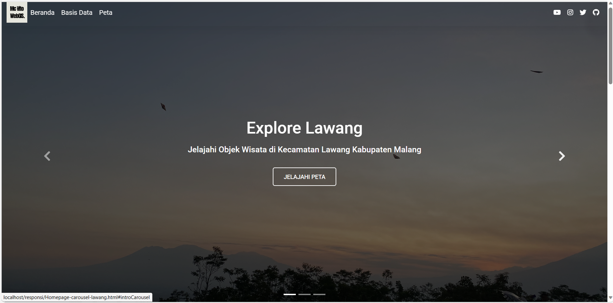
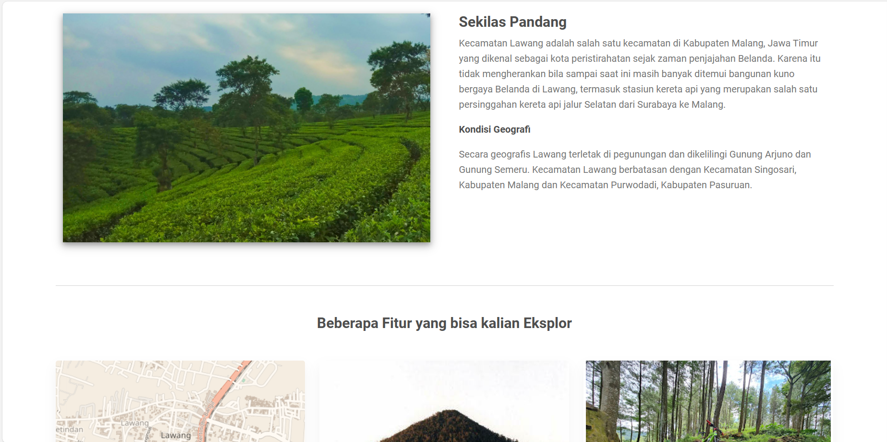
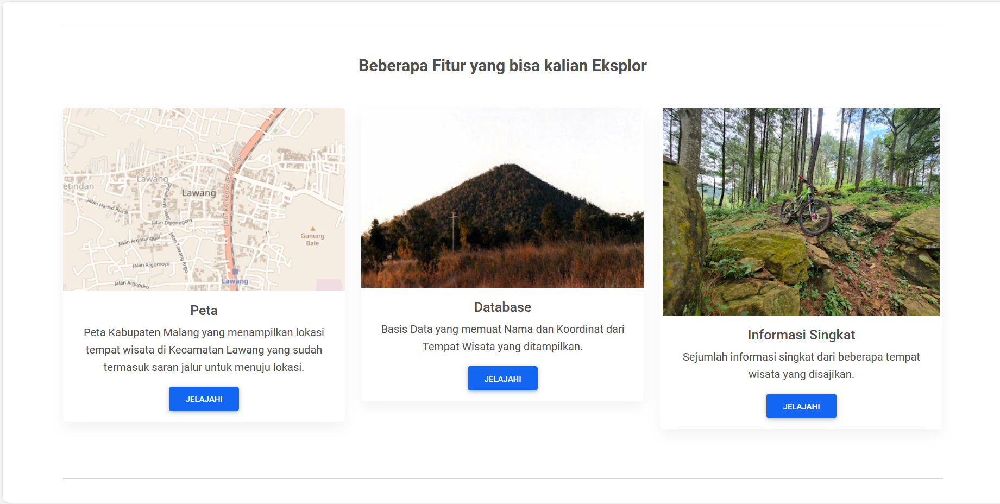
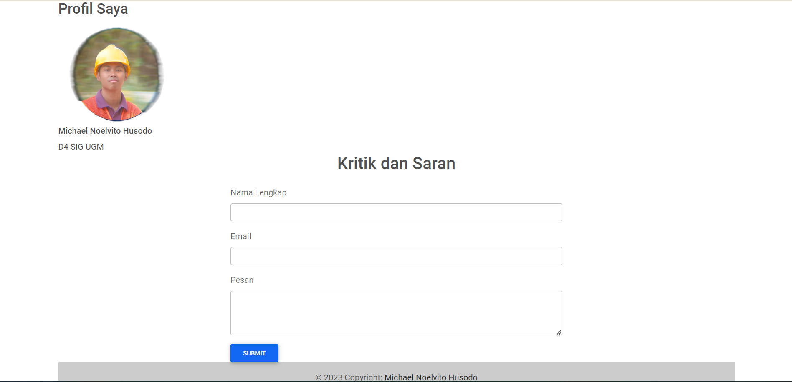
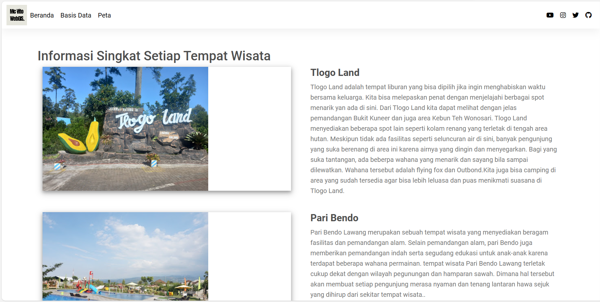
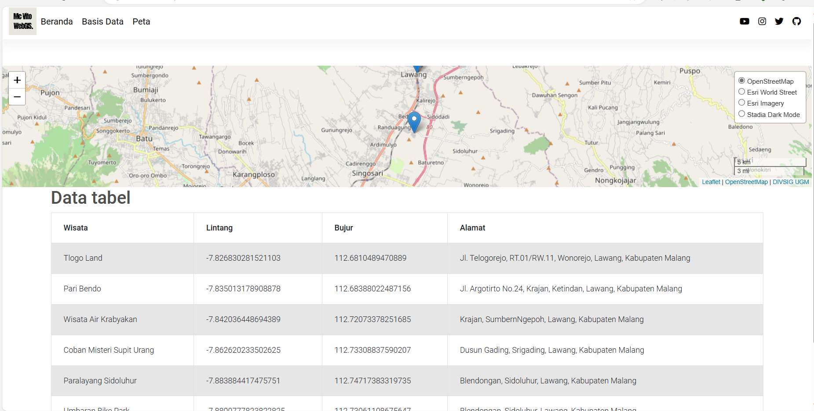
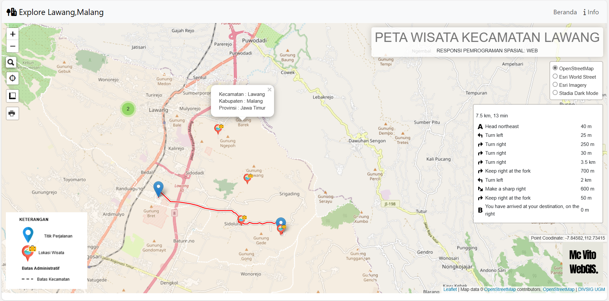

# Explore Lawang
WebGIS Mengenai Tempat Wisata di Kecamatan Lawang Kabupaten Malang

**Latar Belakang
Malang raya sebenarnya sudah terkenal sebagai salah satu destinasi wisata favorit khususnya di Jawa Timur. Namun bila merujuk ke Malang raya, kawasan yang jadi destinasi favorit adalah Kota Batu, Kota Malang, dan Kabupaten Malang bagian selatan karena ada pantai. Sementara Kabupaten Malang bagian utara tidak begitu banyak wisatawan. Saya melihat bahwa di kecamatan tempat saya tinggal, Lawang termasuk daerah Kabupaten Malang bagian utara yang mana punya potensi untuk dikembangkan wisatanya.

Komponen Pembangun:
HTML
CSS
PHP
JS
Leaflet.js
Bootstrap
Fontawesome

Sourcecode Pembangun:
- Landing Page terdiri atas dua halaman yaitu index.html dan info.html
- Elemen database ditampilkan dalam Database.html yang basis datanya berasal dari pemanggilan database phpMyAdmin oleh index.php
- Peta Digital (WebGIS) berupa petaMalang.html yang data shapefilnya dari pemanggilan Geoserver oleh wfsgeoserver.php

Tautan Halaman web: https://mcnoelvito.github.io/PGweb_responsi/
>**Tangkapan Layar Komponen
>
>
>
>
>
>
>

